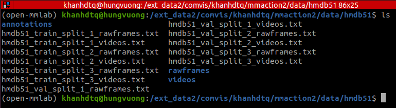

# Image classification 

Run the following:

**MNIST**

    sudo /home/khanh/anaconda3/envs/demo_sr_env/bin/python capture_packets.py
    ssh -R 8085:127.0.0.1:8085 khanhdtq@172.16.77.146
    ./run_server.sh configs/mnist.yaml
    ./run_clients.sh configs/mnist.yaml ../working

**GLD23k**

    sudo /home/khanh/anaconda3/envs/demo_sr_env/bin/python capture_packets.py
    ssh -R 8085:127.0.0.1:8085 khanhdtq@172.16.77.146

    ./run_client.sh configs/gld23k.yaml ../working /ext_data2/comvis/khanhdtq/gld/data_user_dict/gld23k_user_dict_train.csv \
        /ext_data2/comvis/khanhdtq/gld/data_user_dict/gld23k_user_dict_test.csv /ext_data2/comvis/khanhdtq/gld/images

    ./run_server.sh configs/gld23k.yaml /home/dothi/Desktop/gld/images ../working

or in a more manually manner:

    CUDA_VISIBLE_DEVICES=0 python -m classification_client --cid=0 --cfg_path="configs/gld23k.yaml" --working_dir="../working" --server_address="127.0.0.1:8085" --data_dir="/ext_data2/comvis/khanhdtq/gld/images"

    CUDA_VISIBLE_DEVICES=1 python -m classification_client --cid=1 --cfg_path="configs/gld23k.yaml" --working_dir="../working" --server_address="127.0.0.1:8085" --data_dir="/ext_data2/comvis/khanhdtq/gld/images"

# Video recognition

## **HMDB51**

### MoViNets

Download and extract HMDB51 dataset:

    ./hmdb_prepare_data.sh

Set the paths:

    WORKING_DIR="../working"
    CFG_PATH="configs/hmdb51.yaml"
    DATA_DIR=""
    TEST_TRAIN_SPLITS_PATH=""

First split the dataset among the clients by run:
    
    python -m datasets.hmdb51 $WORKING_DIR $CFG_PATH $TEST_TRAIN_SPLITS_PATH

Start the server:

    SERVER_ADDRESS="127.0.0.1:8085"
    python -m classification_server --cfg_path=$CFG_PATH --server_address=$SERVER_ADDRESS --data_dir=$DATA_DIR --working_dir=$WORKING_DIR

Start the clients:

    SERVER_ADDRESS="127.0.0.1:8085"

    CUDA_VISIBLE_DEVICES=0 python -m classification_client --cid=0 --cfg_path=$CFG_PATH --working_dir=$WORKING_DIR --server_address=$SERVER_ADDRESS --data_dir=$DATA_DIR

    CUDA_VISIBLE_DEVICES=1 python -m classification_client --cid=1 --cfg_path=$CFG_PATH --working_dir=$WORKING_DIR --server_address=$SERVER_ADDRESS --data_dir=$DATA_DIR
    
### SlowOnly
After data preparation, the data looks like this:


Data partition script will create a directory called `partition` in this directory which contains `.txt` files `hmdb51_train_split_*_client_{i}_rawframes.txt` and `hmdb51_val_split_*_rawframes.txt`. After that, copy `rawframes`, `partition` to machines where clients and server will be running on, put them in the same directory. 

Now we can load client dataset by setting:
```shell 
# client i 
data_train_cfg = dict(
    type='RawframeDataset',
    ann_file=f'path/to/partition/hmdb51_train_split_1_client_{i}_rawframes.txt',
    data_prefix='path/to/rawframes',
    pipeline=train_pipeline)

val_train_cfg = dict(
    type='RawframeDataset',
    ann_file=f'path/to/partition/hmdb51_val_split_1_rawframes.txt',
    data_prefix='path/to/rawframes',
    pipeline=val_pipeline)
```

Split dataset among clients by running:
```shell
python -m datasets.hmdb51_mmaction2 $DATA_DIR 2 1
```

Start the server:
```shell
SERVER_ADDRESS="127.0.0.1:8085"
MMACTION="/home/dothi/Desktop/mmaction2"
CFG_PATH="configs/hmdb51_rgb_k400_pretrained.py"
FED_CFG_PATH="configs/hmdb51_mmaction2.yaml"
DATA_DIR="${MMACTION}/data/hmdb51"
WORK_DIR="/home/dothi/Desktop/fed_exps/hmdb51_slowonly"

python -m recognition_video_server --server_address=$SERVER_ADDRESS --cfg_path=$CFG_PATH --fed_cfg_path=$FED_CFG_PATH --data_dir=$DATA_DIR --work_dir=$WORK_DIR
```

Start the clients:
```shell
SERVER_ADDRESS="127.0.0.1:8085"
MMACTION="/ext_data2/comvis/khanhdtq/mmaction2"
CFG_PATH="configs/hmdb51_rgb_k400_pretrained.py"
FED_CFG_PATH="configs/hmdb51_mmaction2.yaml"
DATA_DIR="${MMACTION}/data/hmdb51"
WORK_DIR="/ext_data2/comvis/khanhdtq/fed_hmdb51_slowonly"

CUDA_VISIBLE_DEVICES=0 python -m recognition_video_client --cid=0 --cfg_path=$CFG_PATH --fed_cfg_path=$FED_CFG_PATH --work_dir=$WORK_DIR --data_dir=$DATA_DIR --server_address=$SERVER_ADDRESS

CUDA_VISIBLE_DEVICES=1 python -m recognition_video_client --cid=1 --cfg_path=$CFG_PATH --fed_cfg_path=$FED_CFG_PATH --work_dir=$WORK_DIR --data_dir=$DATA_DIR --server_address=$SERVER_ADDRESS
```

Note: `total_epochs` in `configs/hmdb51_rgb_k400_pretrained.py` and `local_e` in `configs/hmdb51_mmaction2.yaml` need to be the same. For now, set them manually.

## **UCF101**
### TSM 
Set the paths on both machines:
- On machine that are to run server:
```shell
SERVER_ADDRESS="127.0.0.1:8085"
MMACTION="/home/dothi/Desktop/mmaction2"
CFG_PATH="configs/ucf101_rgb_tsm_k400_pretrained.py"
FED_CFG_PATH="configs/ucf101.yaml"
DATA_DIR="${MMACTION}/data/ucf101"
WORK_DIR="/home/dothi/Desktop/fed_exps/ucf101_tsm"
```
- On machine that are to run clients:
```shell
SERVER_ADDRESS="127.0.0.1:8085"
MMACTION="/ext_data2/comvis/khanhdtq/mmaction2"
CFG_PATH="configs/ucf101_rgb_tsm_k400_pretrained.py"
FED_CFG_PATH="configs/ucf101.yaml"
DATA_DIR="${MMACTION}/data/ucf101"
WORK_DIR="/ext_data2/comvis/khanhdtq/fed_ucf101_tsm"
```

Split dataset among clients by running:
```shell
python -m datasets.dataset_mmaction2 $DATA_DIR 4 1 
```

Start the server:
```shell
python -m recognition_video_server --server_address=$SERVER_ADDRESS --cfg_path=$CFG_PATH --fed_cfg_path=$FED_CFG_PATH --data_dir=$DATA_DIR --work_dir=$WORK_DIR
```

Start the clients:
```shell 
CUDA_VISIBLE_DEVICES=0 python -m recognition_video_client --cid=0 --cfg_path=$CFG_PATH --fed_cfg_path=$FED_CFG_PATH --work_dir=$WORK_DIR --data_dir=$DATA_DIR --server_address=$SERVER_ADDRESS

CUDA_VISIBLE_DEVICES=1 python -m recognition_video_client --cid=1 --cfg_path=$CFG_PATH --fed_cfg_path=$FED_CFG_PATH --work_dir=$WORK_DIR --data_dir=$DATA_DIR --server_address=$SERVER_ADDRESS

CUDA_VISIBLE_DEVICES=2 python -m recognition_video_client --cid=2 --cfg_path=$CFG_PATH --fed_cfg_path=$FED_CFG_PATH --work_dir=$WORK_DIR --data_dir=$DATA_DIR --server_address=$SERVER_ADDRESS

CUDA_VISIBLE_DEVICES=3 python -m recognition_video_client --cid=3 --cfg_path=$CFG_PATH --fed_cfg_path=$FED_CFG_PATH --work_dir=$WORK_DIR --data_dir=$DATA_DIR --server_address=$SERVER_ADDRESS
```

## **AFORS2022**
Set the paths:
```shell 
SERVER_ADDRESS="127.0.0.1:8085"
MMACTION="/ext_data2/comvis/khanhdtq/mmaction2"
CFG_PATH="configs/afors_rgb_slowonly_k400_pretrained.py"
FED_CFG_PATH="configs/afors.yaml"
DATA_DIR="${MMACTION}/data/afors"
WORK_DIR="/ext_data2/comvis/khanhdtq/fed_afors_slowonly"
```

Split dataset among clients by running:
```shell
python -m datasets.dataset_mmaction2 $DATA_DIR 2 
```

Start the server:
```shell
python -m recognition_video_server --server_address=$SERVER_ADDRESS --cfg_path=$CFG_PATH --fed_cfg_path=$FED_CFG_PATH --data_dir=$DATA_DIR --work_dir=$WORK_DIR
```

Start the clients:
```shell 
CUDA_VISIBLE_DEVICES=0 python -m recognition_video_client --cid=0 --cfg_path=$CFG_PATH --fed_cfg_path=$FED_CFG_PATH --work_dir=$WORK_DIR --data_dir=$DATA_DIR --server_address=$SERVER_ADDRESS

CUDA_VISIBLE_DEVICES=1 python -m recognition_video_client --cid=1 --cfg_path=$CFG_PATH --fed_cfg_path=$FED_CFG_PATH --work_dir=$WORK_DIR --data_dir=$DATA_DIR --server_address=$SERVER_ADDRESS
```
## **AFOSR**
First resize the videos (do it only one time):
```shell 
cd tools
python resize_videos.py /ext_data2/comvis/datasets/afors2022/data /ext_data2/comvis/khanhdtq/afosr2022/data_172x172 172 
```
Extract RGB frames:
```shell
cd tools  
python build_rawframes.py /ext_data2/comvis/datasets/afors2022/data /ext_data2/comvis/khanhdtq/afosr2022/rgb_frames
```


```shell
SERVER_ADDRESS="127.0.0.1:8085"
CFG_PATH="configs/afosr_movinetA0.yaml"
VIDEO_DIR="/ext_data2/comvis/khanhdtq/afosr2022/data_172x172"
TRAIN_ANNOTATION_PATH="/ext_data2/comvis/khanhdtq/afosr2022/train.txt"
VAL_ANNOTATION_PATH="/ext_data2/comvis/khanhdtq/afosr2022/val.txt"
PARTITION_DIR="/ext_data2/comvis/khanhdtq/afosr2022/partition"
```

Split dataset among clients by running:
```shell 
python -m datasets.video_dataset --n_clients=4 --video_dir $VIDEO_DIR --train_ann=$TRAIN_ANNOTATION_PATH --val_ann=$VAL_ANNOTATION_PATH --working_dir=$PARTITION_DIR
```

Start the server:
```shell 
SERVER_DIR="/ext_data2/comvis/khanhdtq/afosr2022/fed_exps/04052022"
CUDA_VISIBLE_DEVICES=1 python -m video_server --server_address=$SERVER_ADDRESS --cfg_path=$CFG_PATH --data_dir=$PARTITION_DIR --work_dir=$SERVER_DIR
```

Start the client:
```shell 
CUDA_VISIBLE_DEVICES=2 python -m video_client --server_address=$SERVER_ADDRESS --cid=0 --cfg_path=$CFG_PATH --data_dir=$PARTITION_DIR 
CUDA_VISIBLE_DEVICES=3 python -m video_client --server_address=$SERVER_ADDRESS --cid=1 --cfg_path=$CFG_PATH --data_dir=$PARTITION_DIR
CUDA_VISIBLE_DEVICES=3 python -m video_client --server_address=$SERVER_ADDRESS --cid=2 --cfg_path=$CFG_PATH --data_dir=$PARTITION_DIR
CUDA_VISIBLE_DEVICES=3 python -m video_client --server_address=$SERVER_ADDRESS --cid=3 --cfg_path=$CFG_PATH --data_dir=$PARTITION_DIR
``` 