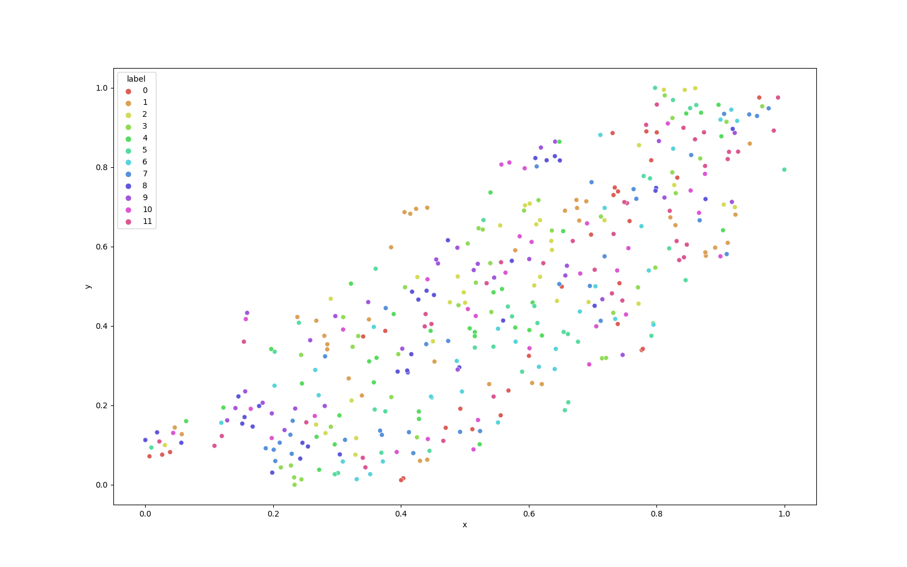
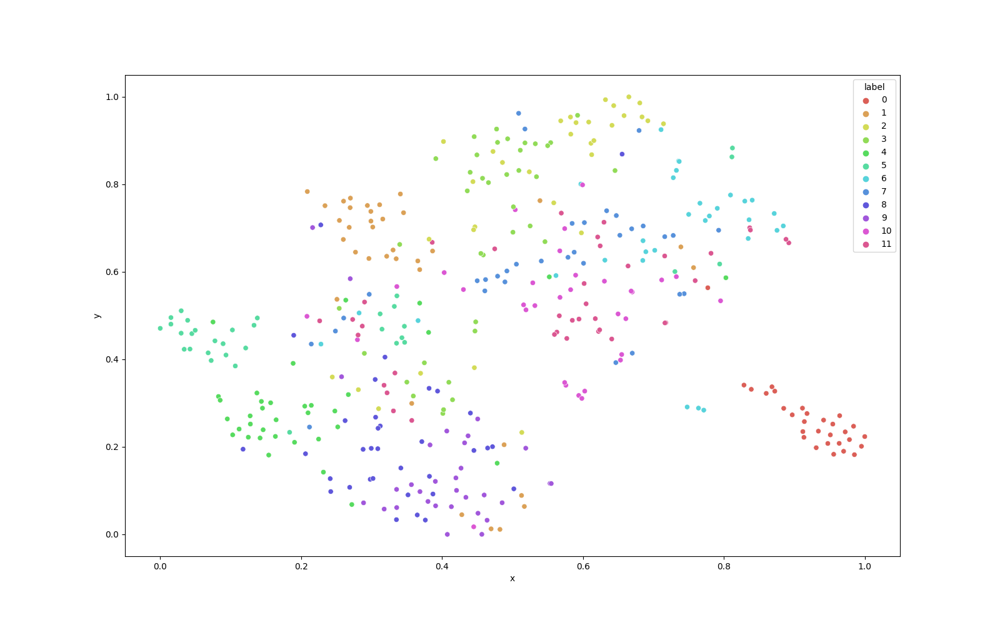
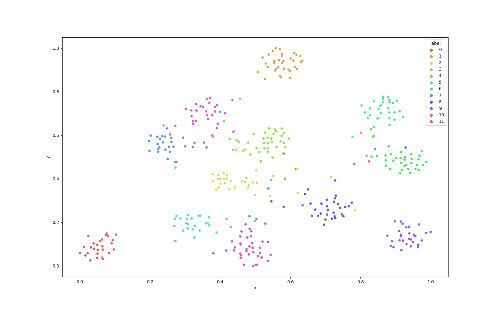
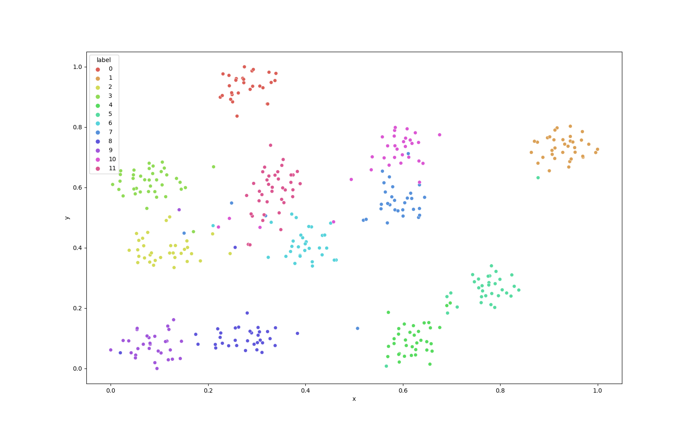

# Date 26/09/2022 - 30/09/2022
## **Introduction**

## **Experiments**
The experiments are conducted on AFOSR2022 dataset and for all them, the following configuration are applied:

| Arch        | Frame size           | Rounds  | Local epochs| Num clients| FL |
| :-----: |:-----:| :-----:|:----:|:-----:|:-----:|
| ResNet183d | 224 | 30 | 3 | 3 | FedAvg

Set the paths by running:
```shell
source set_paths.sh
```
### **Run experiment with `partition rate = 1.0`**
First start server 
```shell
# screen -S fed_server
CUDA_VISIBLE_DEVICES=1 python -m video_server --server_address=$SERVER_ADDRESS --cfg_path="examples/afosr2022/configs/afosr_fedavg_p10.yaml" --data_dir=$DATA_DIR --work_dir="$DATA_DIR/fed_exps_p10"
```
Start clients
```shell
# screen -S client0
CUDA_VISIBLE_DEVICES=2 python -m sorted_video_client --server_address=$SERVER_ADDRESS --cid=0 --cfg_path="examples/afosr2022/configs/afosr_fedavg_p10.yaml" --data_dir=$DATA_DIR --work_dir="$DATA_DIR/fed_exps_p10"

# screen -S client1
CUDA_VISIBLE_DEVICES=2 python -m sorted_video_client --server_address=$SERVER_ADDRESS --cid=1 --cfg_path="examples/afosr2022/configs/afosr_fedavg_p10.yaml" --data_dir=$DATA_DIR --work_dir="$DATA_DIR/fed_exps_p10"

# screen -S client2
CUDA_VISIBLE_DEVICES=3 python -m sorted_video_client --server_address=$SERVER_ADDRESS --cid=2 --cfg_path="examples/afosr2022/configs/afosr_fedavg_p10.yaml" --data_dir=$DATA_DIR --work_dir="$DATA_DIR/fed_exps_p10"
```
### **Run experiment with `partition rate = 0.7`**
```shell
# screen -S fed_server
CUDA_VISIBLE_DEVICES=1 python -m video_server --server_address=$SERVER_ADDRESS --cfg_path="examples/afosr2022/configs/afosr_fedavg_p07.yaml" --data_dir=$DATA_DIR --work_dir="$DATA_DIR/fed_exps_p07"
```
Then start clients
```shell
# screen -S client0
CUDA_VISIBLE_DEVICES=2 python -m sorted_video_client --server_address=$SERVER_ADDRESS --cid=0 --cfg_path="examples/afosr2022/configs/afosr_fedavg_p07.yaml" --data_dir=$DATA_DIR --work_dir="$DATA_DIR/fed_exps_p07"

# screen -S client1
CUDA_VISIBLE_DEVICES=2 python -m sorted_video_client --server_address=$SERVER_ADDRESS --cid=1 --cfg_path="examples/afosr2022/configs/afosr_fedavg_p07.yaml" --data_dir=$DATA_DIR --work_dir="$DATA_DIR/fed_exps_p07"

# screen -S client2
CUDA_VISIBLE_DEVICES=3 python -m sorted_video_client --server_address=$SERVER_ADDRESS --cid=2 --cfg_path="examples/afosr2022/configs/afosr_fedavg_p07.yaml" --data_dir=$DATA_DIR --work_dir="$DATA_DIR/fed_exps_p07"
```
### **Run experiment with Sorted Accuracy Strategy**
Start server
```shell
# screen -S fed_server
CUDA_VISIBLE_DEVICES=1 python -m sorted_video_server --server_address=$SERVER_ADDRESS --cfg_path="examples/afosr2022/configs/afosr_fedavg_sorted.yaml" --data_dir=$DATA_DIR --work_dir="$DATA_DIR/fed_exps_sorted" --num_selected=2
```
Then start clients
```shell
# screen -S client0
CUDA_VISIBLE_DEVICES=2 python -m sorted_video_client --server_address=$SERVER_ADDRESS --cid=0 --cfg_path="examples/afosr2022/configs/afosr_fedavg_sorted.yaml" --data_dir=$DATA_DIR --work_dir="$DATA_DIR/fed_exps_sorted"

# screen -S client1
CUDA_VISIBLE_DEVICES=2 python -m sorted_video_client --server_address=$SERVER_ADDRESS --cid=1 --cfg_path="examples/afosr2022/configs/afosr_fedavg_sorted.yaml" --data_dir=$DATA_DIR --work_dir="$DATA_DIR/fed_exps_sorted"

# screen -S client2
CUDA_VISIBLE_DEVICES=3 python -m sorted_video_client --server_address=$SERVER_ADDRESS --cid=2 --cfg_path="examples/afosr2022/configs/afosr_fedavg_sorted.yaml" --data_dir=$DATA_DIR --work_dir="$DATA_DIR/fed_exps_sorted"
```
## **Results**
### **t-SNE visualization**
Run this to generate t-SNE visualization
```shell
CFG_PATH="examples/afosr2022/configs/afosr_fedavg_sorted.yaml"
WORK_DIR="$DATA_DIR/fed_exps_sorted"
CUDA_VISIBLE_DEVICES=1 python -m visualize_tsne --cid=0 --cfg_path=$CFG_PATH --data_dir=$DATA_DIR --work_dir=$WORK_DIR
```
Some results from client 0:
- Round 0:

- Round 1:

- Round 10:

- Round 29:

### **Global accuracies**
| ID | Datetime | Strategy | Best round | Top1 acc | Top5 acc | Notes  
| :---: | :-----: | :-----: | :-----: |:-----:| :-----:| :-----: |
| 1 | 03/10/2022 - 09:25 | Sorted FedAvg | 20 | 81.48% | 97.96% |
| 2 | 03/10/2022 - 13:15 | FedAvg | 16 | 81.43% | 97.96% | 
| 3 | 03/10/2022 - 18:10 | FedAvg | 15 | 81.37% | 97.68% | Just re-run #2 to see the effect of random seed not being fixed. One client was dead and was not turned on again.

### **Clients' local accuracies**
## **Conclustion and next steps**

# Date 05/10/2022 - 07/10/2022
## **Experiments**
`FedAvg` with `n_clients = 20`, 5 clients participate in each round:
```shell
python -m fedavg_simulation --work_dir="$DATA_DIR/fed_sim" --data_dir=$DATA_DIR --server_device="cuda:1" --cfg_path="configs/afosr_simulation.yaml"
```
Best accuracy at round 29: 76.0%


`SortedFedAvg` with `n_clients = 20`, 10 clients participate in each round, 5 clients with the best top1 accuracies are selected:
```shell
python -m sorted_fedavg_simulation --work_dir="$DATA_DIR/fed_sorted_sim" --data_dir=$DATA_DIR --server_device="cuda:1" --cfg_path="configs/afosr_sorted_sim.yaml"
```
Best accuracy at round 24: 71.3%
